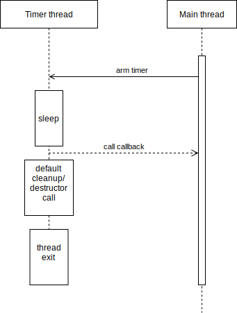
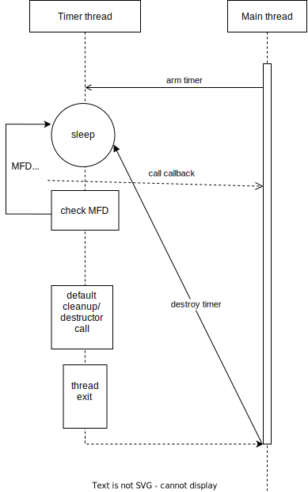
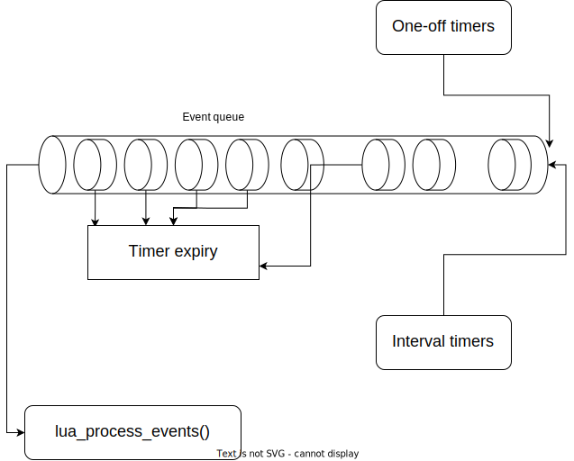

Mockit - C and Lua timer callback library
==================================================

##### Table of Contents
* [Overview](#overview)
* [Timer precision](#timer-precision-and-granularity)
* [Mockit](#mockit)
    * [Mockit_gettime](#mockit_gettime)
    * [Mockit_mstimestamp](#mockit_mstimestamp)
    * [Mockit_bsleep](#mockit_bsleep)
    * [One-off timers](#one-off-timers)
    * [Interval timers](#interval-timers)
* [Luamockit](#Luamockit)
    * [Luamockit Design and Implementation notes](#luamockit-design-and-implementation-notes)
    * [Lua script design](#lua-script-design)
* [Tests](#tests)
* [Todos](#todos)


Overview
----------

`mockit` is split into two components - a C library, usable from C
code independently, and a Lua library wrapper, that exposes the C
library to Lua along with some additional features.

While there are some functions that would be convenient to use from C
it's clear the primary target is Lua: C already has features for
sleeping, getting the time with millisecond granularity (well,
_nanosecond_) and setting interval timers to the same accuracy
-- while Lua is missing these.

The primary feature this library seeks to make available to both C and
Lua is a system for one-off and interval callbacks: that is to say, the
ability to have a function be called back once after a specified period,
or repeatedly at a specified interval.

Additionally, a few more functions are made available for
convenience's sake that allow you to:
 * sleep with millisecond granularity in a way that avoids oversleeping
   and - optionally - automatically resumes sleeping when interrupted by
   a signal (handler).
 * get the current time as a tuple of seconds since the epoch and milliseconds
   since the last second. This is meant to make the ordinary Unix
   timestamp a little more precise.
 * get a millisecond timestamp (useful because the usual Unix timestamp
   is typically provided in seconds only). This is just a shortcut to
   what could very easily be obtained from the 'time tuple'.

Timer precision and granularity
--------------------------------

Linux is _not a real-time operating system_ (`RTOS`). Certain features
can be adjusted toward this purpose (e.g. the nice value of a process,
tweaking the Linux Kernel task scheduler etc) it doesn't change this
fact. This means the OS - and by extension any application running on
it -- cannot make any guarantees about time-dependent actions getting
to be performed at the exact time they're supposed to run at, for
example with nanosecond precision. Timers, sleeping, and the like
are subject to the current system load, the OS scheduler etc which
makes the accuracy rather volatile.

This is a long way of say by way of explanation that `mockit` expects
input in _milliseconds_ and therefore allows specification of sleep
and timers with millisecond _granularity_ but it can't guarantee that
these will be carried out with millisecond _precision_. Timestamps and
sleep do in fact seem to be both granular and precise down to the
millisecond, but interval timers in particular will suffer from slight
(e.g. dozens of milliseconds) imprecision.

Critical to note is that interval timers are most likely to
experience such imprecision under two sets of circumstances:
 * you have many interval timers running at the same time: the
   precision degrades the more timers there are
 * you have one or more timers of very high frequency. For instance,
   having a timer scheduled for every millisecond.

For `Lua` there's another catch here: timers don't call the associated
_Lua_ callback on expiry due to the danger of asynchronous calls back
into a Lua _state_ (as discussed at length below). Instead, timer
expiry instances generate 'events' pleaced in an event queue. _Lua_
must process these events and it's up to the user when this is done
such that even if a user has a timer scheduled to run every millisecond,
if they only decide to drain the queue every other minute, they will
have accumulated many timer expiry events in the queue and the
callback(s) associated with the timer(s) will only be called back
when the user decides to drain the queue.

Mockit
--------

This section contain various example code snippets to illustrate how
the C library may be used. **NOTE** that for the sake of simplicity
and brevity the examples below forgo looking at the return values.
This is incorrect -- robust usage _should_ ensure the return values are
looked at so that error conditions are properly dealth with or
recovered from.

**FMI** on exactly what each function returns can be found in the
source code `(src/mockit.c`); each function is amply commented so
the information is readily found.

### `Mockit_gettime()`

 * get (secs, msecs) time tuple; secs = seconds since
   the Unix epoch; msecs= milliseconds since the last second.

```C
time_t secs = 0;
long msecs =  0;
Mockit_gettime(&secs, &msecs);
printf("%zus, %lums\n", secs, msecs); // e.g. 1659641952s, 561ms
```

### `Mockit_mstimestamp()`

* get milisecond timestamp

Timestamps in seconds since the unix epoch are extremely common. The
`date` utility can be used for this in the shell, the `C` standard
library's `time()` returns such a timestamp, and so forth.
It's sometimes the case that _millisecond_ timestamps are needed
though. One normally has to use more precise APIs for this purpose.
`Mockit_mstimestamps()` aims to be such a convenience function.

```C
uint64_t msts = 0;
Mockit_mstimestamp(&msts);
printf("msts: %" PRIu64 "\n", msts);  // e.g. msts: 1659642227734
```

### `Mockit_bsleep()`

 * go to sleep for specified number of milliseconds

The function `sleep()` is often too coarse; the function `nanosleep()`
may be too heavy and inconvenient to use. `Mockit_bsleep()` is aimed
to be a more approachable API that takes a millisecond specificiation.
```C
/* sleep for 0.3 seconds, and resume on interrupts */
Mockit_bsleep(300, true, NULL);

/* sleep for 2.1 seconds and do not resume if interrupted by signal
handlers */
Mockit_bsleep(2100, false, NULL);

/* sleep for 0.07 seconds ie 70 ms */
Mockit_bsleep(70, false, NULL);
```

### One-off timers

A one-off aka one-shot timer is a sleep in a separate thread for the
specified duration which ends with a user-registered callback being
called on timer expiry. Since by definition this 'timer' only expires
_once_, it is only _once_ that the callback gets called.



The callback is expected to have a certain prototype and the timer
itself requires certain cleanup on teardown. The user may (or may
_need_ to) also register a destructor callback that knows how to clean
things up if using the 'ctx' extension - which allows the user to pass
additional arbitrary data to the timer callback.

The callback gets called in the same thread as the timer i.e. not in 
the main thread. It's the responsibility of the user to ensure the 
callback is thread-safe and/or reentrant etc as needed.

```C
void my_callback(void *dt){
    printf("called back!\n");
}

int main(int argc, char **argv){
    struct mockit mit = {0};
    Mockit_static_init(&mit,
                      my_callback,
                      1200,
                      false,
                      NULL,
                      NULL);

    Mockit_arm(&mit);
    Mockit_bsleep(3500, true, NULL);
}
```

Note **one-off** timers do _not_ need to be explicitly destroyed via
`Mockit_destroy()` the way interval timers (covered next) do. A
destructor may be registed if teardown is somehow special, otherwise
one-off timers can clean up after themselves. The thread governing a
one-off timer is always _detached_ such that its resources are
automatically released on thread exit and the thread need not and
cannot be joined.

Below is another example with a timer augmented with user-allocated
data which a custom destructor is registered for that knows how to
tear it down.
```C
void my_callback(void *dt){
    struct mockit *mit = dt;
    int *i = mit->ctx;
    printf("called back (%i) !\n", *i);
}

int my_destructor(void *dt){
    struct mockit *mit = dt;
    free(mit->ctx);
    free(mit);

    return 0;
}

int main(int argc, char **argv){
    int *myint = calloc(1, sizeof(int));
    assert(myint);
    *myint = 187;

    struct mockit *mit = NULL;
    mit = Mockit_dynamic_init(my_callback,
                        1200,
                        false,
                        (void *)myint,
                        my_destructor);

    Mockit_arm(mit);
    Mockit_bsleep(3500, true, NULL);
}
```

### Interval timers

While one-off timers are inherently self-disarming, interval aka
cyclic timers will keep going until explicitly disarmed.
They'll specifically repeat this sequence of actions (in a separate
thread):
 * sleep for specified interval
 * if `MFD` mark is not set (set via the
   `Mockit_disarm`/`Mockit_destroy` functions), then
   call the registered callback and go back to sleep.

_Iff_ `MFD` _is_ set, the timer will break out of this loop, set `MOD`
in acknowledgement, _not_ call the callback, and then perform either
default cleanup or otherwise call a destructor function, if
registered.



An example of an interval timer with default cleanup is shown next:
```C
void my_callback(void *dt){
    struct mockit *mit = dt;
    printf("called back \n");
}

int main(int argc, char **argv){
    struct mockit *mit = NULL;
    mit = Mockit_dynamic_init(my_callback,
                        500,
                        true,
                        NULL,
                        NULL);

    Mockit_arm(mit);
    Mockit_bsleep(1300, true, NULL);
    Mockit_destroy(mit);
}
```

A second example with user-allocated data and a destructor is shown:
```C
void my_callback(void *dt){
    struct mockit *mit = dt;
    int *i = mit->ctx;
    printf("called back (%i) !\n", *i);
}

int my_destructor(void *dt){
    struct mockit *mit = dt;
    free(mit->ctx);
    free(mit);

    return 0;
}

int main(int argc, char **argv){
    int *myint = calloc(1, sizeof(int));
    assert(myint);
    *myint = 187;

    struct mockit *mit = NULL;
    mit = Mockit_dynamic_init(my_callback,
                        1230,
                        true,
                        (void *)myint,
                        my_destructor);

    Mockit_arm(mit);
    Mockit_bsleep(3500, true, NULL);
    Mockit_destroy(mit);
}
```

### Timer termination and cleanup

This section will summarize/explain the details of timer termination
and cleanup from C perspective. Lua users can choose to skip this
section.

One-off timers _cannot_ be disarmed. They are self-disarming: they run
_once_ and then they terminate. The thread they run in is _detached_
so one-off timers cannot and need not be joined. Default cleanup is
sufficient _unless_ the user opts to use the `ctx` field for arbitrary
(e.g. dynamically-allocated data) in which a destructor should be 
registered such that resources are properly released.

Conversely, interval timers will run 
until explicitly disamrmed.

Disarming an interval timer (as mentioned, one-shot timers cannot be
disarmed) simply gets the timer to stop. It does _not_ in and of
itself release the resources associated with the timer back to the
system.

To release said resources, a timer must be _destroyed_. There are a
few nuances here: 
 1. the `pthread` resources associated with the thread itself must be freed
 2. the timer object (`struct mockit`) and any user-allocated memory
    pointed to by the `ctx` field of the `mockit` struct must also be
    freed.

Each will be covered in turn.
 1. Releasing pthread resources

One-off timers always run in `detached` mode, i.e. they do not have to
be `joined`. Nothing special needs to be done here.

Interval timers do _not_, on the other hand, detach themselves. They
must therefore be joined at the end to release their resources back to
the system. Disarming an interval timer and then joining the
associated thread are both done via the common `destroy` function used
with interval timers.

2. Releasing memory associated with the timer object/struct

Both one-off and interval timers are **self-destroying**, meaning they
clean up after themselves when exiting the thread (as explained
below).

At destruction time, a timer will by default simply run `free()` on the 
timer object (`struct mockit`) before exitting the thread. The `ctx`
field is not freed. If the user uses this field (which is reserver for
arbitrary use by the user) to point to some arbitrary memory
(user-allocated or not), they should also provide a destructor
function that knows how to tear down the timer. 

If a destructor function is provided by the user, it should take care of
freeing _both_ the `struct mockit` (if dynamically initialized/allocated)
and_ any memory pointed to by the `ctx` field of this struct as 
appropriate. Without a destructor being supplied, by default the
library will only call _free()_ on the `struct mockit` if dynamically
allocated -- and never on the `ctx` field.
If the user makes use of the `ctx` field and points it 
to some dynamically-allocated chunk of memory but they do not provide 
a suitable destructor, memory leakage may ensue.

It's vital to keep the following points in mind:
 * the user _must_ call `Mockit_destroy()` on _interval_ timers to
   free their resources. `Mockit_destroy()` calls `Mockit_disarm()`
   implicitly on interval timers, hence users need not call the latter
   and should only call the former. `Mockit_disarm()` also waits to
   _join_ the timer thread when it exits. This ensures proper thread
   cleanup and is _necessary_ because the interval-timer threads are
   _not_ detached.

 * one-off timers _cannot_ be destroyed. They're only disarmed and
   then they terminate when they get around to it. Calling
   `Mockit_destroy()` on a one-shot timer is completely synonymous
   with caling `Mockit_disarm()`.

 * disarming an interval timer may not happen instantaneously. 
   Since `MFD` is checked on each wakeup, if the `disarm` function is
   called when the timer is already sleeping, the timer can only 
   terminate after completing its current sleep. This means there's the
   danger of having to wait for a long time if the interval value is 
   very large. 
   Imagine the (somewhat absurd) scenario where a timer (interval or
   one-off) is set to a duration/interval of 1h. The user must then
   **wait** for up to 1h until the timer wakes up and sees `Mockit_MFD` 
   has been set, after which it will terminate. In such a scenario, 
   it may be preferable to simply exit the program without waiting: 
   the resources will be released back to the `OS` after program exit
   anyway. This is all the more so with one-off timers as they
   _cannot_ be joined so there's no way to wait for their completion
   other than by sleeping.


------------------------------------------------

Luamockit
-----------

This section will give an extended example of how one would use the Lua
interface to `mockit`. For more details (e.g. about the return values of
functions and such) see `src/luamockit.c`, which has ample comments,
and for more examples, see `tests/tests.lua`.

The code is pretty self-explanatory and the comments
should also help make it that much clearer.

**NOTES**
 - The code below assumes `luamockit.so` is already on a standard path
   (i.e. in Lua's `cpath`. Otherwise the user can set `package.cpath`)
   in the script or `LUA_CPATH` in the environment, as appropriate).
 - for the sake of simplicity the script forgoes looking at any return
   values. For a robust usage, return values _should_ be looked at so
   as to catch and recover/deal with error conditions.

```Lua
#!/usr/bin/lua5.3

package.cpath = package.cpath .. ";" .. "../out/?.so;"

local mit = require("luamockit")

-- get an integral millisecond timestamp
local msts = mit.mstimestamp() -- e.g. 1659732124334

-- get a time tuple of seconds since the epoch and milliseconds since
-- the last second; on error, (nil, error code) tuple returned instead
local s,ms = mit.time()        -- e.g. 1659732124, 334
if not s then print("time failed with error code " .. ms)

-- sleep for 2.3 seconds; resume if interrupted by a signal handler etc
mit.sleep(2300, true)

-- sleep for 0.07 seconds; just stop if interrupted; if
interruped/failed, an (error code, time left) tuple is returned
local error_code, time_left = mit.sleep(70) -- same as lmit.sleep(2300, false)

-------------------------------------------------------------------------

-- dummy callback to be associated with timer expiry events
local function cb()
    print(string.format("called callback at %s", mit.mstimestamp()))
end

---------------------------------------------------------------
-- one-off timer example: process event after arbitrary time --
---------------------------------------------------------------
mit.oneoff(2000, cb)
--- do stuff (or sleep) for arbitrary period of time ---

-- 1 or 0 depending on whether the timer has expired
pending = mit.pending()
print("pending = " .. pending)

-- this will call cb IFF the timer has in fact expired and the
-- resulting timer expiry event has been enqueued
mit.process_events()

----------------------------------------------------
-- one-off timer example: block until event ready --
----------------------------------------------------
mit.oneoff(3500, cb)

-- only unblocks on event enqueue or (optional) specified ms timeout
mit.wait(8000)
mit.process_events()

----------------------------------------------------------------
-- interval timer example: process event after arbitrary time --
----------------------------------------------------------------
-- generate expiry event every 0.2 secs
local it = mit.getit(200, cb)

-- do stuff or sleep for arbitrary length of time
mit.sleep(2000)
pending = mit.pending()   -- e.g. 10 'events' to be handled
mit.process_events()      -- call cb as a result of timer expiry events

-- wait indefinitely to properly clean up timer-associated resources;
-- remove references to object so it can be garbage collected
it = it:destroy(true)

----------------------------------------------------
-- interval timer example: process events forever --
----------------------------------------------------
-- this is particularly suited to daemons running an infinite
-- loop that need to perform an action at regular intervals

-- second callback
local function cb2()
    print("called cb2 at " .. mit.mstimestamp())
end

-- third callback
local function cb3()
    print("called cb3 at " .. mit.mstimestamp())
end

-- run 3 interval timers concurrently to populate the event queue
it = mit.getit(1300, cb)
it2 = mit.getit(800, cb2)
it3 = mit.getit(3333, cb3)

while true do
    mit.wait() -- block indefinitely until event ready
    mit.process_events()  -- process events _sequentially_
end
```

## Luamockit Design and Implementation notes

  * For a more extensive discussion on the motivations that ultimately
    led to this design, see `docs/luamockit.md`. Note that there the 
    functions are referred to by the `C` names they have in that file 
    (e.g. `lua_process_events()`) while in this `README.md` section 
    they're referred to by the names they would be used with in a Lua 
    script (e.g. `luamockit.wait()`).

Interval and one-off timers generate an 'event' on expiry. The event is simply
a structure that contains some internal details, primarily the lua callback associated
with this event that must be called back as a result of the timer having expired.
This event gets added to a global event queue in this library.

**At no point is LUA called back asynchronously.** This is what the
queue design is meant to accomplish.

The queue simply gets populated, from multiple threads (and therefore enqueing
and dequeing operations must be and are protected by a mutex to ensure serialization).

The lua script itself must periodically call `luamockit.process_events()`
which will go through the event queue and dequeue each pending event and 'handle' it.
To handle an event means to call the Lua callback associated with it, and then
remove it from the event queue.



Therefore each call to `luamockit.process_events()` has a backlog that it needs to clear.
The more rarely `luamockit.process_events()` gets called, the bigger the backlog and the
less precise the timers will seem.

That is to say, if the user registers a callback to be called back every 3 seconds
but the `luamockit.process_events()` gets called every 10 seconds, then the callback will
only get called every 10 seconds and every 10 seconds it will be called ~3 times
in a row (because the timer for the callback will have expired ~3 times)!

It's therefore important to call the `luamockit.process_events()` function as often as
possible : or, specifically, about as frequently as the callback with the shortest
interval timer.

To solve this problem another function is provided - `luamockit.wait()` -
which makes a blocking call to wait on the list to be populated. It returns
immediately if there are already pending events, otherwise it unblocks as
soon as an event is added to the queue or after the (optional) specified timeout.
The timeout is a guard to protect against the scenario where _no_ new events
get generated (in which case the function would end up blocking forever).

### Lua script design

The above points mean that a certain design naturally imposes itself for a lua script
using the interval timers feature of this library (though this is by no means mandatory).
The script will most often take the form of an infinite loop that blocks with
`luamockit.wait()` and then calls `luamockit.process_events()` every time it unblocks.

This makes it most suited to scripts meant to be running as daemons. This might
not be as much of a problem as it sounds, since that's exactly the context where
one would typically even want to have callbacks called asynchronously or at certain
intervals: event loops dispatching events.


Todos
--------

    * increase fixed-width int type used from 32 to 64 bits

